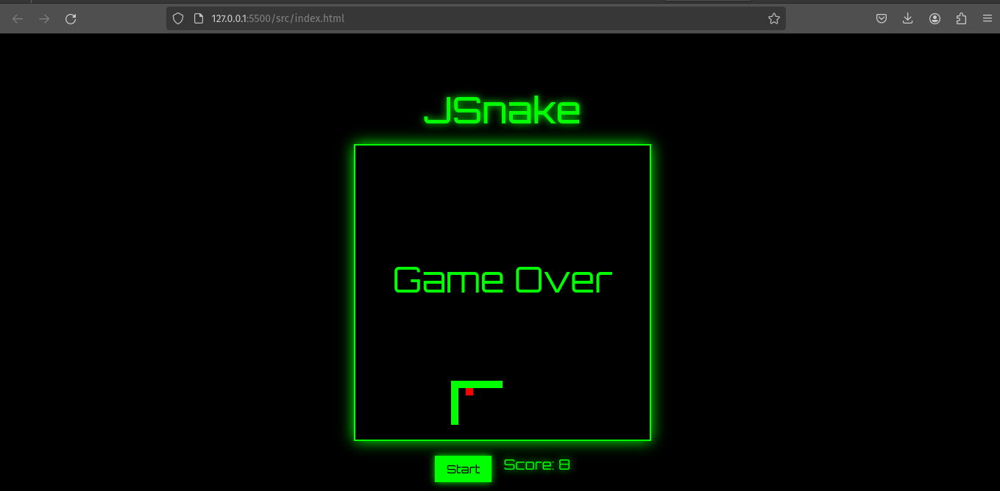
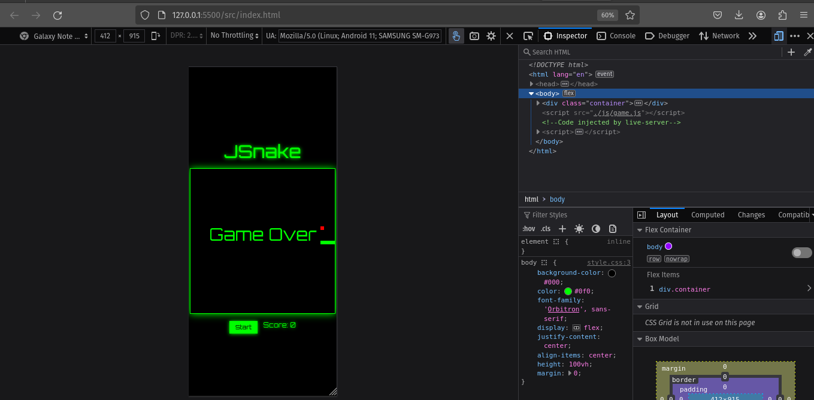

# JSnake

JSnake es un clásico juego de Snake desarrollado con JavaScript, HTML y CSS. Cuenta con un diseño futurista y responsivo.

## Capturas de pantalla

## Cómo jugar

1. Clona o descarga este repositorio.
2. Abre el archivo `index.html` en tu navegador web.
3. Haz clic en el botón "Start" para comenzar un nuevo juego.
4. Utiliza las teclas de flecha para controlar la serpiente.
5. Come la comida para aumentar tu puntaje.
6. Evita chocar con las paredes o con el cuerpo de la serpiente.

## Tecnologías utilizadas

- JavaScript
- HTML
- CSS

## Autor

Jasson Gomez.